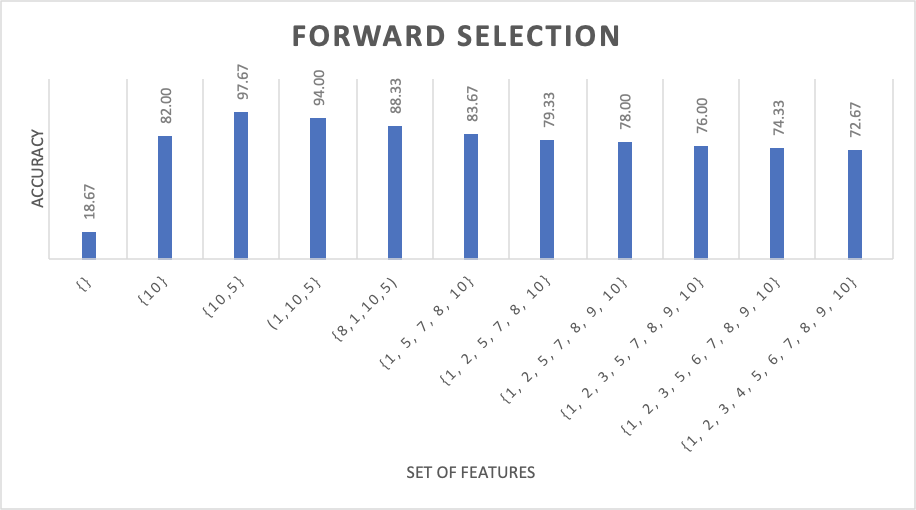
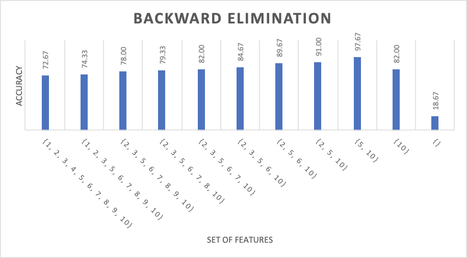

# feature-selection

## Dependencies

1. Numpy: it’s used to store data

2. PyInquirer: it’s used to construct the command-line interface

## Execution

> python featureselection.py

## Performance

CPU: Intel Core i9-10900K @ 20x

RAM: 32G

|                      | Small  dataset   (10  features & 300 instances) | Large dataset  (100  features & 500 instances) |
| -------------------- | ----------------------------------------------- | ---------------------------------------------- |
| Forward Selection    | 0.533s                                          | 265.572s                                       |
| Backward Elimination | 0.527s                                          | 261.707s                                       |

## Results

